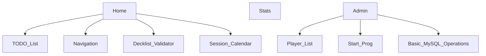
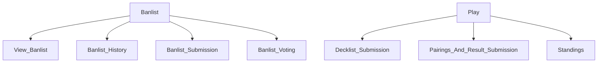

# Page Structure

Parent Nodes are pages.
Child Nodes are features.

&#42; Mermaid.js is used to render this graph, Markdown Preview Enhanced is used to view in VSCode

## Priority Levels
What functionality needs to be added first

### Essential
- Admin: Start Prog
- Banlist: Banlist Submission
- Banlist: Banlist Voting
- Play: Pairings
- Play: Standings
- Play: Result Submission

### Good to Have
- Banlist: View Banlist

### Would be Nice
- Home: Decklist Validator
- Banlist: Banlist History

### Not Needed
- Stats
- Home: TODO List
- Home: Session Calendar
- Admin: Player List
- Admin: MySQL Operations